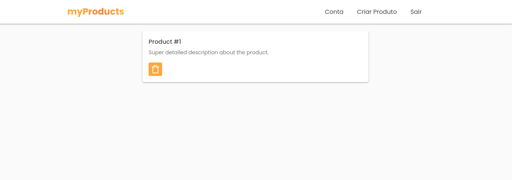

# myProducts

---

## 🔖 Content Table

- [📕 About](#📕-about)
- [⚒️ Used Technologies](#⚒️-used-technologies)
- [✨ Features](#✨-features)
- [🧑‍🎓 What I Learned](#🧑‍🎓-what-i-learned)
- [🤝Be a Contributor](#🤝-be-a-contributor)
- [🔓 License](#🔓-license)

---

## 📕 About

myProducts is a CRD (Create, Read, Delete) app, powered by Firebase. It's main purpose is just learning how to use the technologies provided by Firebase, such as Firestore and Hosting.

---

## ⚒️ Used Technologies

To develop this app, I used these technologies:

- HTML5
- CSS3
- Javascript
- Firebase
- Workbox
- PostCSS
- Webpack

---

## ✨ Features

- Responsivity
- Real-time updats based on Firestore collections updates
- Persistence of data offline
- PWA features, such as offline mode, caching and fast responses

---

## 🧑‍🎓 What I Learned

After experimenting PWAs in other projects, most of these being just
websites with something to read, I decided to take a step further, and
try to implement a database along with the great PWA features.

To do so, I chose Firebase, most because of the provided services for free,
which is awesome, and due to a long-time curiosity too.

At first, it was pretty confusing to handle the modular SDK, but as I dived
further, it turned to be quite easy use. Use Firestore and seeing the data
being updated on the frontend, as the collections on the backend were modified
was just fantastic, and I fell in love at that moment.

The authentication methods provided also were just aewsome to use. I decided to
implement only the email/password method, because it looked like a nice way to
start, but I'm already quite pumped to use all of the other features too.

And lastly, the hosting service. It was pretty different from the way I was used
to (set up a remote repo, connect to Vercel and let it do it's job). However,
the CLI was very explanatory and useful, setting up the needed files by itself,
and also some Github Actions, wich I didn't even used before.

So, with the website already up and running, I decided to convert the app into a
PWA. I already had some experience configuring service workers and stuff like that
by hand, so I chose to use Workbox to handle all of the caching and routing logic.
It turned out to be quite fun to use, and easy too.

So, after spending two days developping the app, and another morning converting it
to a PWA, the job is done. I learned how to use the awesome features provided by
Firebase (at least the basics), and also acquired more experience with PWAs. Also
discovered some cool tricks that I didn't know about, like using a webpack
multi-compiler.

It was a very fun project to work on, and got me hyped to experiment some more of
the other Firebase features. Alongside, the project gave me the courage to learn
by myself, without watching a hours long course or something like that.

---

## 🤝 Be a Contributor

Have any idea that can help boost the project, and want to share it? It's simple!

1. Fork the project
2. Modify what you want
3. Commit the changes
4. Open a Pull Request

---

## 🔓 License

This project is under MIT license. Click [here](./LICENSE.md) for details.
